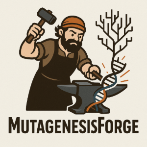

<p align="center">
  
</p>

------------

[](https://pypi.org/project/MutagenesisForge/)
[](https://github.com/AkeyLab/MutagenesisForge/actions/workflows/draft-pdf.yml)

# MutagenesisForge - A framework for modeling codon-level mutational biases and d<sub>N</sub>/d<sub>S</sub> selection

## Overview
**MutagenesisForge** is a codon-level simulation software designed to calculate d~N~/d~S~ null models built on user-inputed data for comparative genomic analyses. It allows for the construction of input data-built codon-specific null models of evolution designed to offer data complementary to d<sub>N</sub>/d<sub>S</sub>values produced from popular calculator tools. With MutagenesisForge, simulation functionality is brought to the user through one tool. The `exhaust` and `context` methods are available both through the **MutagenesisForge** Python package or as a command line interface.

Additionally, MutagenesisForge supports mutation modeling according to popular substitution models through the `MutationModel` object.

## Installation
```bash
pip install MutagenesisForge
```

## Exhaustive Codon Model

### Example CLI Usage
```bash
MutagenesisForge exhaustive --flags
```

### Example Python Usage
```python
import MutagenesisForge as mf

exhaust_dNdS = mf.exhaustive(
  path='example.fa,
  bed_path='example.bed',
  model='K2P',
  alpha=2.0,
  beta=1.0,
  gamma=0.5
)
```


## Context Codon Model

### Example CLI Usage
```bash
MutagenesisForge context --flags
```

### Example Python Usage
```python
import MutagenesisForge as mf

context_dNdS = mf.context(
  vcf='example.vcf'
  fasta='example.fa',
  bed='example.bed',
  context_model='codon',
  model='JC69',
  gamma=0.5
)
```

## MutationModel Object

### Example Usage
```python
import MutagenesisForge as mf

# Initialize the MutationModel object using K2P substitution model
K2P_model = mf.MutationModel(
  model_type='K2P',
  alpha=2.0
  gamma=1.0
  gamma=0.5
)

# See the probability for an adenine to mutation to a guanine according to the mutation model
mut_probs = K2P_model.get_mutation_probability(
  base='A',
  mutated_base='G'
)

# Simulate a mutation to an adenine according to the mutation model
mutated_base = K2P_model.mutate(
  base = 'A'
)
```
